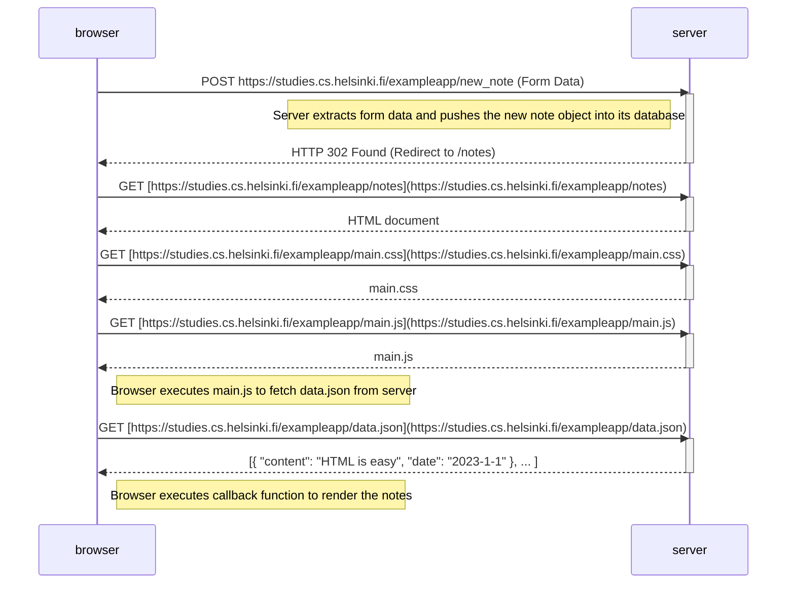
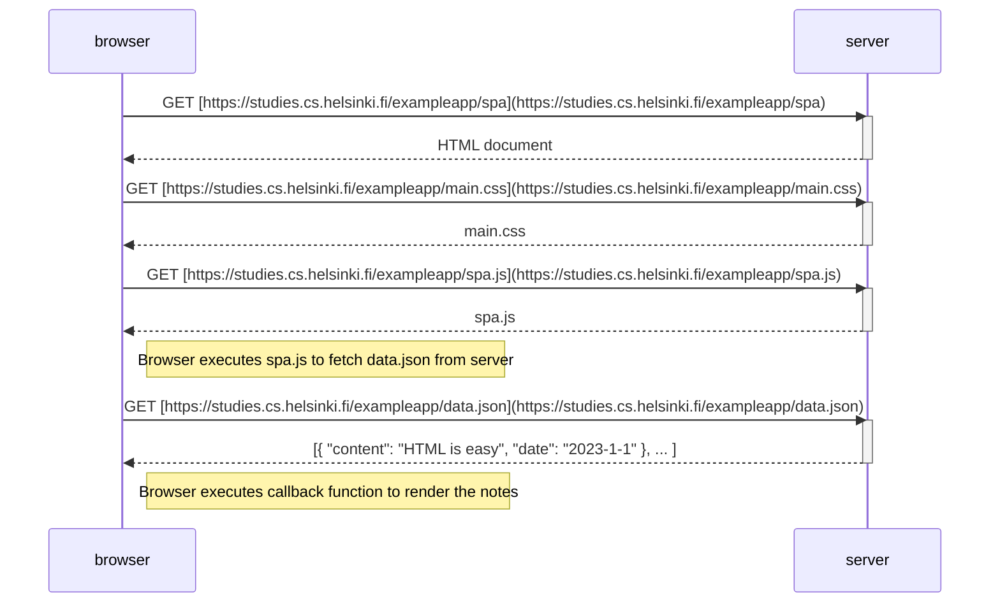
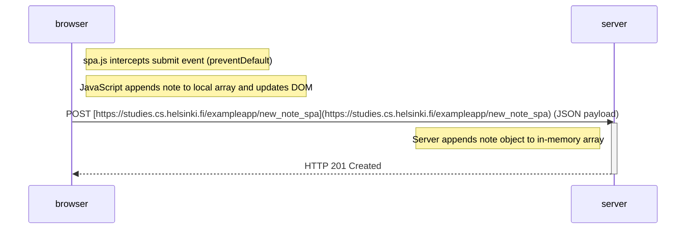

# Part 0 Exercises

## Exercise 0.4: ...

```mermaid
sequenceDiagram
  participant browser
  participant server

  browser->>server: POST https://studies.cs.helsinki.fi/exampleapp/new_note (Form Data)
  activate server
  Note left of server: Server extracts form data and pushes the new note object into its database
  server-->>browser: HTTP 302 Found (Redirect to /notes)
  deactivate server

  browser->>server: GET [https://studies.cs.helsinki.fi/exampleapp/notes](https://studies.cs.helsinki.fi/exampleapp/notes)
  activate server
  server-->>browser: HTML document
  deactivate server

  browser->>server: GET [https://studies.cs.helsinki.fi/exampleapp/main.css](https://studies.cs.helsinki.fi/exampleapp/main.css)
  activate server
  server-->>browser: main.css
  deactivate server

  browser->>server: GET [https://studies.cs.helsinki.fi/exampleapp/main.js](https://studies.cs.helsinki.fi/exampleapp/main.js)
  activate server
  server-->>browser: main.js
  deactivate server

  Note right of browser: Browser executes main.js to fetch data.json from server

  browser->>server: GET [https://studies.cs.helsinki.fi/exampleapp/data.json](https://studies.cs.helsinki.fi/exampleapp/data.json)
  activate server
  server-->>browser: [{ "content": "HTML is easy", "date": "2023-1-1" }, ... ]
  deactivate server

  Note right of browser: Browser executes callback function to render the notes
 
```

---

## Excercise 0.5: ...

```mermaid
sequenceDiagram
  participant browser
  participant server

  browser->>server: GET [https://studies.cs.helsinki.fi/exampleapp/spa](https://studies.cs.helsinki.fi/exampleapp/spa)
  activate server
  server-->>browser: HTML document
  deactivate server

  browser->>server: GET [https://studies.cs.helsinki.fi/exampleapp/main.css](https://studies.cs.helsinki.fi/exampleapp/main.css)
  activate server
  server-->>browser: main.css
  deactivate server

  browser->>server: GET [https://studies.cs.helsinki.fi/exampleapp/spa.js](https://studies.cs.helsinki.fi/exampleapp/spa.js)
  activate server
  server-->>browser: spa.js
  deactivate server

  Note right of browser: Browser executes spa.js to fetch data.json from server

  browser->>server: GET [https://studies.cs.helsinki.fi/exampleapp/data.json](https://studies.cs.helsinki.fi/exampleapp/data.json)
  activate server
  server-->>browser: [{ "content": "HTML is easy", "date": "2023-1-1" }, ... ]
  deactivate server

  Note right of browser: Browser executes callback function to render the notes
```

---

## Exercise 0.6: ...

```mermaid
sequenceDiagram
  participant browser
  participant server

  Note right of browser: spa.js intercepts submit event (preventDefault)
  Note right of browser: JavaScript appends note to local array and updates DOM

  browser->>server: POST [https://studies.cs.helsinki.fi/exampleapp/new_note_spa](https://studies.cs.helsinki.fi/exampleapp/new_note_spa) (JSON payload)
  activate server
  Note left of server: Server appends note object to in-memory array
  server-->>browser: HTTP 201 Created
  deactivate server
```